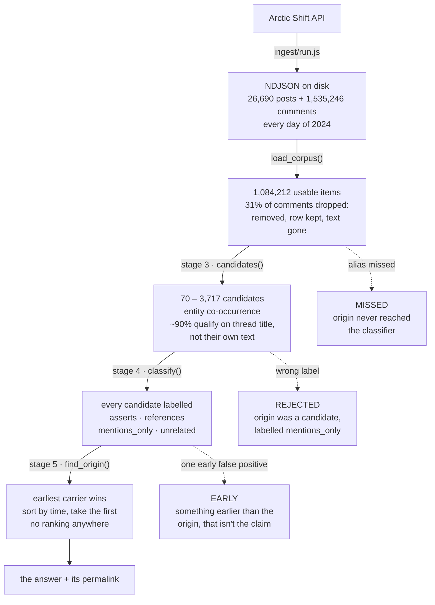

# rumour-trace

Given a rumour, find where it first surfaced on Reddit.

Corpus is r/Fauxmoi for 2024: 26,690 posts and 1,535,246 comments, every day
present.

## Status

Ingest, coverage and case validation work. Three cases and one control. BM25
baseline runs; its answers are wrong in an instructive way (see below).

## Architecture

Five stages. The work is in narrowing 1.5M items to a set small enough to read
in full, then reading it — there is no ranking anywhere after stage 3.



Each stage owns one failure, which is why the eval reports three outcomes
rather than two: a first-pass miss and a wrongly-rejected candidate need
opposite fixes, and a false early needs a different fix again.


Around it:

```
eval/run_pipeline.py   score stages 3-5 against labelled cases
eval/run.py            BM25 baseline, for comparison (see RESULTS.md)
eval/validate.py       every id in every case resolves, and the quotes are real
eval/spread.py         draw when a claim surfaced, as SVG
eval/candidates.py     propose new cases; it proposes, it does not label
```

### The load-bearing decision

Stage 5 returns the **earliest** carrier, not the best match, and that single
choice determines what everything else has to be good at. Ordinary retrieval
metrics are useless here — if the true origin sits at rank 400, a perfect top 5
has failed — but more importantly, the answer is decided by the earliest
mistake the classifier makes anywhere in the year, not by its average accuracy.
Give 3,365 thread-inherited fragments a 1% error rate and an early false
positive is near-certain.

That is why stage 4 is a classifier and not a threshold, why the rubric carries
worked examples of specific corpus failures, and why the eval reports hours-late
and a false-early rate rather than recall@k.

## What the corpus cannot show you

Complete days are not complete content. **31.1% of comments are moderator-
removed and Arctic Shift keeps the row but not the text.** On a gossip
subreddit the removed ones skew towards exactly the claims worth tracing, so
that number is a hard ceiling on what any origin search here can see — and it
is invisible unless you look for it, because every day is present and nothing
errors.

Origins can also predate the platform entirely. In the tabloid case a
sweep of every comment in the fortnight before found nothing: the rumour
arrived from tabloid press, and the earliest trace on Reddit is someone
asking whether it was true. "Origin" here means earliest trace on this
subreddit, never where the rumour was invented.

## Why this isn't ordinary retrieval

You are not looking for the best match. You are looking for the **earliest**
match above a similarity threshold, which inverts most of the usual instincts:

- **Precision@5 is worthless.** If the true origin sits at rank 400, a
  reranker that produces an immaculate top 5 has failed completely. Recall
  over the whole corpus is what matters, then sort by time.
- **The origin is the worst-worded version.** A rumour is at its vaguest when
  it first appears. Any query you write will be phrased like the polished
  version, and the polished version is what the origin is furthest from.
- **Popularity points the wrong way.** The origin has no votes yet.

The tabloid case demonstrates all three at once — a couple's split, where the
three earliest traces are a question and two tabloid reports:

```
2024-05-15 22:34   score    1   "are these split rumors, just rumors?"
2024-05-16 00:59   score    1   [tabloid headline: couple headed for a split]
2024-05-16 01:45   score 1489   [tabloid headline: couple headed for a divorce]
```

The one everyone remembers is third, and outscores the origin 1489 to 1.

## What "origin" means here

First surfaced *on this subreddit*, not invented here. r/Fauxmoi is largely a
link aggregator for tabloid press, and the honest finding from the first case
is that the rumour arrived from outside: a sweep of all 62,772 comments from
1–15 May 2024 found 87 that name both parties and **zero** that connect them
to a split before the first post. Reddit is downstream. Claiming otherwise
would be the same category of error as reporting a LEGO piece missing when
it is simply round the back.

## One hop upstream

A run now prints where each item entered the subreddit, because posts carry an
outbound url and a flair and both were being thrown away:

```
https://www.reddit.com/comments/1ct0tes
  via lifeandstylemag.com · Breakups / Makeups / Knockups
```

This is the outlet that carried the claim here, not the source of the rumour.
Where Life & Style got it is not in this corpus and never will be, and a rumour
that begins as a publicist's phone call has no digital origin to find.

The blanks are the useful part. The tabloid case's origin is `self-post, no
external link` — someone asking whether the rumour was true, citing nothing, because the
claim had reached them by a route this corpus cannot see. The blind-item
case's origin is a comment in a thread flaired `Blind Item`. Those two lines say more
about how a rumour arrived than the timestamps do.

## Ingest

```bash
node ingest/run.js posts 2024-01-01 2025-01-01
```

```bash
node ingest/coverage.js data/Fauxmoi-posts-2024-01-01-2025-01-01.ndjson
```

Coverage exits non-zero on any missing or unusually thin day. This is not
housekeeping: over a corpus with holes, every "first mention" is
unfalsifiable and every negative result is meaningless.

```bash
node ingest/run.js comments 2024-01-01 2025-01-01
```

Comments are not optional. I assumed they would have to earn their place and
was wrong: in the blind-item case the origin is a comment 35 days
before the announcement, and the earliest *post* implies a split without
asserting one eight days later. A post-only corpus cannot solve that case at
all. Blind items are a primary rumour vector in gossip and they surface in
conversation, not in headlines.

Set `SUBREDDIT` to ingest something else.

## Validation

```bash
python3 eval/validate.py
```

Resolves every id in every case file against the corpus, checks the kind and
timestamp, and checks that quoted evidence really appears in the item quoted.
This exists because a case file once shipped with invented comment ids. In a
tool whose entire output is "here is the receipt", a citation that does not
resolve is the worst failure available. It caught a wrong timestamp on its
first run.

## Eval

See [eval/README.md](eval/README.md) for the case format. Two numbers, neither
of them recall@k: whether the true origin was retrieved at all, and how many
hours late the answer was. Plus a false-early rate, because naming something
earlier that isn't the claim is the one failure a user cannot detect.

## Cost

The classifier is the only part of this that costs money, and the first full
run cost $6. Almost none of that was the corpus: 282k tokens of candidates
went in for about $1.60, and the rest came back out as reasoning.

Thinking is on by default on `claude-opus-5` at effort `high`, and thinking
tokens bill as output at five times the input rate. Nothing in the code asked
for it — omitting the parameter meant no thinking on the previous generation,
and means adaptive thinking on this one. So the run spent roughly three times
the price of the corpus deciding, at length, between four labels against a
fixed rubric.

Effort now defaults to `low`, which is the flat part of that curve for
labelling work:

```bash
CLASSIFY_EFFORT=high python3 eval/run_pipeline.py
```

Raise it and score the result. `correct/rejected/missed` plus the control is
exactly the check that says what the extra spend bought, and the honest answer
may be nothing.

Nothing waits on these responses, so a full scoring run belongs on the batch
API at half price:

```bash
CLASSIFY_BATCH_API=1 python3 eval/run_pipeline.py
```

Results arrive within 24 hours rather than 24 seconds. That is the wrong trade
while iterating on the rubric and the right one for a scoring run, which is why
it is off by default.

## Next

1. Baseline: BM25 over titles, top-k, sort by time. Get a number.
2. More cases. Ten is the minimum worth reporting; the metric is noisy.
3. Embeddings, and find out whether they beat BM25 on a corpus this
   headline-shaped. They may not.
